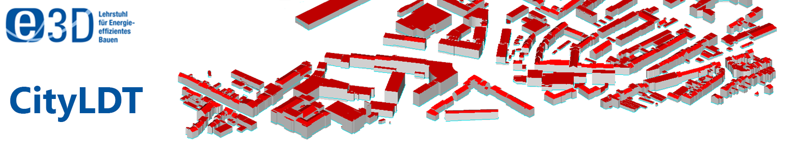

# CityLDT- CityGML Levels of Detail Transformation Tool 

The CityGML Levels of Detail Transformation Tool (CityLDT) is developed by members of the  "Institute of Energy Efficiency and Sustainable Building (e3D), RWTH Aachen University" using Python 3.5+.
This tool can be used for upscaling or downscaling geometries of 3D spatial CityGML building models.
The open-source CityLDT tool currently supports an import and export of LoD0-2. 
It allows users to upscale 3D CityGML models where less/no detailed data exists and can also be used to downscale models for applications such as flood simulations, geographical map591
ping or for storage and exchange in databases.

This GitLab page will be used to further develop the package and make it available under the [MIT License](https://gitlab.e3d.rwth-aachen.de/e3d-software-tools/cityldt/cityldt/-/blob/master/License/LICENSE).

If you have any questions regarding CityLDT feel free to contact us at: [cityatb@e3d.rwth-aachen.de](mailto:cityatb@e3d.rwth-aachen.de)

## Description

Urban planning and resource management generally requires a transformation of the built environment into 3D spatial representations. 
This transformation facilitates systematic analysis of urban areas for their energetic behaviours.
Often clustered together, the 3D representation of individual buildings is commonly developed in form of data models that differ based on their purposes, stakeholders and application requirements. 
Requiring a broad availability of data, geometrical data models along with precise energy specific information benefit urban planners, researchers and scientists to simulate and predict energy demands in cities and city-quarters. 
For urban energy analysis, however, open data models do not generally include the geometric detailing required to represent individual buildings in their respective geographical contexts. 
Therefore, this paper introduces the CityGML LoD Transformation tool for transforming CityGML data models in LoD0-2.
With a user-friendly GUI, CityLDT allows users to transform and edit individual buildings as well as large urban areas.
## Version

The CityLDT is currently being developed. Currently the CityLDT is available in the version 0.1.

## How to use CityLDT

### Dependencies

CityLDT is currently being developed using Python 3.5+ and PySide2 python bindings. However in future, the developers will make it usable with other versions of python 3. 
Futhermore, the following external libraries/python packages are used in the different functionalities of CityLDT:
1. matplotlib
2. numpy
3. pandas
4. pyproj
5. PySide2
6. lxml

### Installation

The CityLDT can be used by cloning or downloading the whole CityLDT package from the GIT Repository. Moreover, the user needs to run the "main.py" for loading the GUI.  

### How to contribute to the development of CityLDT

You are invited to contribute to the development of CityLDT. You may report any issues by using the [Issues](https://gitlab.e3d.rwth-aachen.de/e3d-software-tools/cityldt/cityldt/-/issues) button.

## How to cite CityLDT

Will be available soon.

## License

CityLDT is released by RWTH Aachen University, E3D - Institute of Energy Efficiency and Sustainable Building, under the [MIT License](https://gitlab.e3d.rwth-aachen.de/e3d-software-tools/cityLDT/cityLDT/-/blob/master/License/LICENSE).
